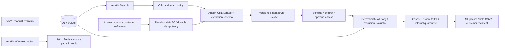

# Architecture

RecallOps is an evidence-to-action workflow, not a conversational agent. A product group drives URL discovery; approved source pages are retrieved and extracted; deterministic code evaluates physical-unit facts; persistent cases, holds, tasks and exports follow.

## Code map

- `lib/core/rules.ts`: typed/versioned extraction rules, tri-state condition evaluation, deterministic explanations and resale eligibility filter.
- `lib/core/csv.ts`: bounded import parsing and spreadsheet-formula-safe export serialization.
- `lib/core/enrichment.ts`: defensive mapping of returned Wire listing data; never a physical serial.
- `lib/server/anakin.ts`: server-only REST adapter with exact product-specific submit/poll contracts, deadlines and integration telemetry.
- `lib/server/workflow.ts`: idempotent imports, Judge Mode, evidence persistence, cases/holds, live investigation and controlled/live reassessment.
- `lib/server/events.ts`: durable pending events, claimed processing, bounded attempts and failure visibility.
- `app/api/*`: validated operator actions, snapshots, exports and public signed webhook receiver.
- `db/schema.ts` / `drizzle/`: persistent relationships and schema-only migrations.
- `app/page.tsx`: Judge entry, inventory, import review, progress, case, evidence, quarantine/tasks, monitoring, health and settings screens.

## Evidence contract

Each preserved document version has its normalized approved URL, title, retrieval timestamp, source authority, markdown hash, provider identifier when returned and integration label. Rule extractions retain a schema version and exact supporting excerpts. Each assessment stores its rule and rule ID, version ID, every criterion result, inventory values and a deterministic explanation. Explanations cannot independently override results.

`CONTROLLED_DEMO_FIXTURE` is a curated replay. The INIU fixture combines a CPSC public-domain recording with minimal manufacturer eligibility excerpts; the supporting manufacturer URL is explicit. Synthetic monitor notices use an invalid-domain identifier and are never an official recall.

`LIVE_ANAKIN` / `CACHED_ANAKIN` represent successful server adapter retrievals. No-source failures have no retrieval label. `DEGRADED_FALLBACK` is reserved; no direct-HTTP fallback is implemented.

## Decision invariants

Missing values are unknown, including for exclusion checks. In `all`, a proven contradiction wins over missing input; in `any`, one complete match satisfies the alternative, while all contradictions are needed to rule it out. Unsupported conditions and unresolved extraction ambiguity require review. An affected decision requires inclusion true and exclusions false. Source conflicts override decisive classifications.

The live path compares complete condition signatures and logical shape across applicable sources. Differences are conservatively reviewed rather than implicitly merged. A monitor changing a different source cannot erase the prior source decision automatically. This is intentionally conservative; production cross-document reconciliation remains a limitation.

## Persistence and idempotency

Organization plus asset tag is unique. Canonicalized import content hashes avoid duplicate imports. URL plus content hash deduplicates snapshots; new extraction output can have a distinct rule record even for identical page bytes. Quarantine, case/task changes and assessments use transaction batches. Existing quarantine is never cleared automatically.

Monitoring deduplication derives from signed-body monitor ID and change ID, not unsigned headers. An event is inserted before acknowledgment and processed in the runtime's background context. Failures remain visible for retry. There is no distributed scheduling service or production queue guarantee.

## Observability and limits

Provider calls persist product, status, timestamps, elapsed milliseconds, actual request count, cache flag, provider ID and credits only if returned. No arbitrary confidence percentage appears. Evidence completeness counts evaluated resolved fields, including mismatches; it is not statistical confidence.

CSV: 256 KB / 1,000 rows. API body: 300 KB; webhook: 100 KB. Source response: 2 MB after retrieval. Source URLs use an explicit HTTPS host allowlist. Expensive operations are limited per local workspace. Provider HTTP calls have a 20-second timeout; job polling is bounded. GET retries respect Retry-After with capped backoff; submit operations are not duplicated automatically.
