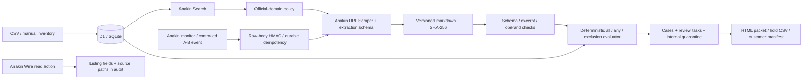

# Architecture

RecallOps is an evidence-to-action workflow, not a conversational agent. A product group drives URL discovery; approved source pages are retrieved and extracted; deterministic code evaluates physical-unit facts; persistent cases, holds, tasks and exports follow.

## Code map

- `lib/core/rules.ts`: typed/versioned extraction rules, tri-state condition evaluation, deterministic explanations and resale eligibility filter.
- `lib/core/extraction.ts`: finite provider schema, successful extraction-envelope decoding, locally bounded validation, and OR-of-ANDs compilation into the evaluator's logic tree.
- `lib/core/csv.ts`: bounded import parsing and spreadsheet-formula-safe export serialization.
- `lib/core/enrichment.ts`: defensive mapping of returned Wire listing data; never a physical serial.
- `lib/server/anakin.ts`: server-only REST adapter with exact product-specific submit/poll contracts, deadlines and integration telemetry.
- `lib/server/workflow.ts`: idempotent imports, Judge Mode, evidence persistence, cases/holds, live investigation and controlled/live reassessment.
- `lib/server/events.ts`: durable pending events, claimed processing, bounded attempts and failure visibility.
- `app/api/*`: validated operator actions, snapshots, exports and public signed webhook receiver.
- `db/schema.ts` / `drizzle/`: persistent relationships and schema-only migrations.
- `app/page.tsx`: Judge entry, inventory, import review, progress, case, evidence, quarantine/tasks, monitoring, health and settings screens.

## Evidence contract

Each preserved document version has its normalized approved URL, title, retrieval timestamp, source authority, markdown hash, provider identifier when returned and integration label. Rule extractions retain a schema version and exact supporting excerpts. Each assessment stores its rule and rule ID, version ID, every criterion result, inventory values and a deterministic explanation. Explanations cannot independently override results.

The provider receives finite `inclusionGroups` and `exclusionGroups`, where each group is a conjunction and groups are alternatives. The schema sent to the provider uses a smaller compatible keyword set; local validators retain size, arity, version and evidence constraints. A successful live extraction has been observed inside `generatedJson` as `{status:"success",data:{...}}`; page completion with extraction status `failed` is rejected. The wrapper applies to extracted JSON, while Search uses its own direct `id`/`results` envelope.

Evidence is preserved from original markdown. Grounding first accepts an exact substring; it may resolve whitespace differences or omitted paired Markdown bold delimiters only when candidate original spans agree. It then stores the original contiguous source span and validates each operand against that excerpt. Wording, case, punctuation, identifier and ambiguous-span differences are not repaired. Scraped content and extracted instructions cannot authorize tools or override deterministic decisions.

`CONTROLLED_DEMO_FIXTURE` is a curated replay. The INIU fixture combines a CPSC public-domain recording with minimal manufacturer eligibility excerpts; the supporting manufacturer URL is explicit. Synthetic monitor notices use an invalid-domain identifier and are never an official recall.

`LIVE_ANAKIN` / `CACHED_ANAKIN` represent successful server adapter retrievals. No-source failures have no retrieval label. `DEGRADED_FALLBACK` is reserved; no direct-HTTP fallback is implemented.

## Decision invariants

Missing values are unknown, including for exclusion checks. In `all`, a proven contradiction wins over missing input; in `any`, one complete match satisfies the alternative, while all contradictions are needed to rule it out. Unsupported conditions and unresolved extraction ambiguity require review. An affected decision requires inclusion true and exclusions false. Source conflicts override decisive classifications.

The live path compares complete condition signatures and logical shape across applicable sources. Differences normally require review. One bounded policy permits the exact official CPSC INIU BI-B41 notice and its linked official manufacturer page to select the existing manufacturer rule when both extractions are resolved, both identify only INIU BI-B41, both express conjunctions, and every regulator predicate is identical to a manufacturer predicate after supported normalization. An identical brand equality may also be satisfied by the already-grounded subject brand, which the matcher independently requires. Extra manufacturer predicates on an already shared field reject the exception; explicit regulator exclusions must agree. Range direction is preserved, and alternative logic is rejected. This policy does not merge rules or hard-code an inventory assessment. Both source versions remain persisted, and `source.linked_subset_reconciled` records the selection.

Other source pairs and uncertain relationships remain conflicts. A monitor changing a different source cannot erase the prior source decision automatically. General cross-document reconciliation remains a limitation.

## Persistence and idempotency

Organization plus asset tag is unique. Canonicalized import content hashes avoid duplicate imports. URL plus content hash deduplicates snapshots; new extraction output can have a distinct rule record even for identical page bytes. Quarantine, case/task changes and assessments use transaction batches. Existing quarantine is never cleared automatically.

Monitoring deduplication derives from signed-body monitor ID and change ID, not unsigned headers. An event is inserted before acknowledgment and processed in the runtime's background context. Failures remain visible for retry. There is no distributed scheduling service or production queue guarantee.

Live monitors are created paused. `Run now` submits a provider check, stores its queued job ID, and displays only the provider's reported `lastCheckedAt`. A separate URL Scraper retrieval can immediately version the source and reassess inventory; this is recorded as `independent_scrape`, with its own completion time and audit event. It does not establish completion of the queued monitor job or receipt of a webhook. Every source change must pass extraction and deterministic evaluation again before inventory actions change.

## Observability and limits

Provider calls persist product, status, timestamps, elapsed milliseconds, actual request count, cache flag, provider ID and credits only if returned. No arbitrary confidence percentage appears. Evidence completeness counts evaluated resolved fields, including mismatches; it is not statistical confidence.

CSV: 256 KB / 1,000 rows. API body: 300 KB; webhook: 100 KB. Source response: 2 MB after retrieval. Source URLs use an explicit HTTPS host allowlist. Expensive operations are limited per local workspace. Provider HTTP calls have a 20-second timeout; job polling is bounded. GET retries and Wire polling honor provider delays through 30 seconds; longer requested waits produce a deferred failure rather than an early retry. Submit operations are not duplicated automatically. Failed extraction retains its known provider job ID.

September 10–11 REST reports establish application Search success, successful CPSC scraping, successful provider extraction envelopes for both official pages, related INIU shopping-listing enrichment, paused monitor creation and queued run submission. The BI-B41 shopping candidate returned a target 404; the successful Wire demonstration uses a separate INIU 20,000mAh listing and contributes only observed listing fields. External signed webhook delivery and completion of the captured monitor job remain unverified. The [live verification report](docs/live-verification.json) records all four expected outcomes from the final September 11 live investigation and their verification in the compiled app. This bounded result does not measure general live extraction accuracy. See [Anakin contract notes](docs/ANAKIN-CONTRACT-NOTES.md) for response shapes, observed field paths and provider IDs.
