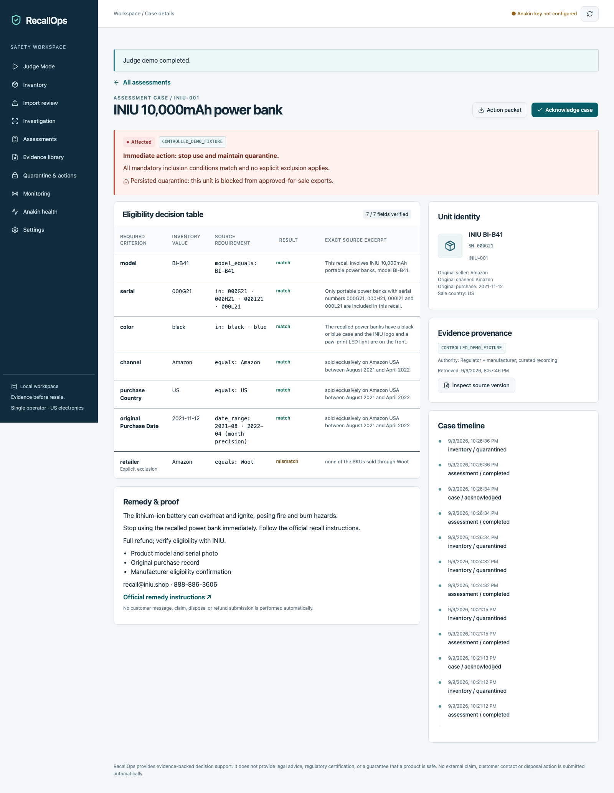

# RecallOps

**An autonomous product-safety agent that prevents recalled products from being resold.**

RecallOps helps small US electronics resellers, refurbishers, repair shops, charities and equipment teams evaluate individual inventory units against recall eligibility. A similar model name is not enough: the unit's serial, variant, original sale channel, purchase period and exclusions can change the result.

Public recall feeds identify candidates. Manufacturer notices add eligibility and remedy details that a feed may omit. RecallOps preserves this evidence, evaluates structured rules deterministically, creates cases and staff tasks, and quarantines affected inventory internally.

**Current release:** functional local hackathon application with a verified controlled demo. Server-side Anakin adapters are implemented and contract-tested. Live application execution requires an Anakin key and remains unverified. See [release verification](docs/RELEASE-VERIFICATION.md) and [limitations](#limitations).



## Quick start

Requirements: Node.js **24**, npm, and a local terminal. No paid database is needed.

```sh
git clone https://github.com/Sree24-ui/RecallOps.git
cd RecallOps
npm ci
npm run db:migrate
npm run dev -- --host 127.0.0.1 --port 3001
```

Open the Local URL printed by the server, normally `http://localhost:3001`. If that port is occupied, follow the URL actually printed. Database migrations must run before using the API. The local D1 emulator persists SQLite data under ignored `.wrangler/state/`; data survives normal server restarts.

Click **Run RecallOps Judge Demo**. The application loads 24 sample units and runs the real matcher and persistence workflow against clearly labeled recorded/synthetic evidence. No API key is needed for this controlled path.

Optional CLI seed against the running server:

```sh
RECALLOPS_URL=http://localhost:3001 npm run seed
```

The seed is idempotent for unchanged inventory. It never silently overwrites different values under an existing asset tag.

Open `RecallOps.code-workspace` in a compatible editor to use the repository as a workspace.

## The three-minute demo

1. Run the Judge Demo and inspect `INIU-001`: all seven evaluated fields are resolved, assessment is `affected`, and the quarantine is persisted.
2. Open Inventory → `INIU-002`: serial `000J21` is excluded. `INIU-003` lacks its serial and needs review. `INIU-004` is excluded because its original seller is Woot.
3. Download the case's HTML action packet. In Quarantine & actions, download the hold list and inspect the staff tasks.
4. Open Monitoring → **Run controlled change A → B**. `MON-001` changes from `excluded_by_notice` to `needs_review` because the new batch requirement is missing.
5. Open Anakin health to distinguish actual app calls from a fixture-only run.

See [DEMO.md](DEMO.md) for expected results and provenance.

## Anakin is the live intelligence layer

All provider credentials and calls stay on the server. The application does not silently fall back to direct scraping.

| Product | App responsibility | Current verification |
| --- | --- | --- |
| Search | Discover relevant official URLs from product identity | REST contract tests; live app call needs key |
| URL Scraper | Preserve markdown and extract schema-bound recall rules through an async job | Mocked submit/poll and evidence-grounding tests; live app extraction not verified |
| Wire | Discover Amazon `am_product_details` as a read action, retrieve listing data, record supported returned fields and their paths | Contract tests; live output mapping not yet verified |
| Monitoring | Create paused monitors, show real IDs/state, run checks, validate signed events, preserve versions and rerun matching | Contract/security tests plus controlled A/B path; live monitor not created |

Three successful connected Anakin calls were captured during initial research: one Search and fresh regulator/manufacturer scrapes. This is evidence of connected-tool access, **not** successful execution by this application's REST adapter. Details are in [docs/ANAKIN-CONTRACT-NOTES.md](docs/ANAKIN-CONTRACT-NOTES.md).

### Configure live execution

```sh
cp .env.example .dev.vars
```

Edit `.dev.vars` locally and set `ANAKIN_API_KEY` to your Anakin API key. Never paste a key into source, commit it, put it in a public environment variable, or enter it into an inventory field. Restart the development server.

| Variable | Use |
| --- | --- |
| `ANAKIN_API_KEY` | Server-side `X-API-Key` header for Anakin REST requests |
| `PUBLIC_BASE_URL` | Optional deployed HTTPS origin used to construct `/api/webhook`; localhost cannot receive public webhooks |
| `OPERATOR_TOKEN` | Required to authorize non-local API access; entered into the app's Settings and held in tab memory |

Open **Investigation** and run a live investigation, then **Anakin health**. A successful row shows its real time, request count, provider job ID when available, cache state and any returned credit usage. Missing keys, failed jobs and timeouts are recorded as failures. A configured key alone is not a verified integration.

The gated test reads credentials from environment variables without printing them:

```sh
RUN_LIVE_ANAKIN=1 npm run test:live
```

Set `ANAKIN_API_KEY` securely in that process environment first; `.dev.vars` is loaded by the app runtime, not automatically by the Node test runner.

## Matching and actions

The only assessment states are:

- `affected`: all inclusion conditions match and no explicit exclusion applies.
- `excluded_by_notice`: at least one required condition contradicts the record or a complete exclusion applies.
- `needs_review`: missing/unsupported facts, incomplete investigation or conflicting/ambiguous evidence.
- `no_relevant_notice_found`: no applicable notice in the declared completed scope. **This never means safe.**

The LLM extracts data only. TypeScript evaluates the condition tree and generates the explanation from the evaluation trace. Date ranges preserve day/month precision; serials retain leading zeros and meaningful characters. Source differences that cannot be reconciled conservatively go to review.

Affected assessments automatically create internal quarantine records. Reassessment and acknowledgment never silently release a hold. Approved-for-sale CSV exports require a non-quarantined, acknowledged record whose latest assessment is excluded or no-notice. This export is an operator workflow filter, not regulatory approval.

Action packets are printable HTML, with criteria, original values, source excerpts, hashes, timestamps, remedy information and a case timeline. CSV hold/customer lists and JSON records are also available. No real messages, claims, purchases or disposal confirmations are submitted.

## Tests and measured evaluation

```sh
npm run typecheck
npm run lint
npm test
npm run evaluate
npm run build
npx playwright install chromium
# Start the development server in another terminal first.
RECALLOPS_URL=http://localhost:3001 npm run test:e2e
```

The evaluation contains **45** labeled controlled combinations, including positive/near matches, exclusions, missing values, conflicts, irrelevant notices, normalization and compound logic. [Measured results](docs/EVALUATION.md) are generated from actual execution, with every case in [evaluation.json](docs/evaluation.json). They do not measure live extraction accuracy, recall coverage or production reliability.

A [GitHub Actions template](docs/github-checks.yml) runs the same local checks. It is not active: the current GitHub sign-in lacks the `workflow` scope. See [activation instructions](docs/DEPLOYMENT.md#github-checks).

Lint covers application, database, scripts and tests. Unmodified vendored UI primitives and the starter mobile hook are excluded from lint because the generated starter produces rule errors there; TypeScript still checks them. No application correctness rules are disabled to obtain a pass.

## Architecture and data

React/Vinext renders the interface; route handlers run in a Cloudflare-compatible server environment. D1/SQLite stores organizations, a local operator, inventory/imports, sales, source documents/versions, rules/conditions, assessments/evidence, cases/tasks, quarantine actions, monitors/events, integration runs and audit events. An additional rate-limit table bounds expensive operations. Prepared statements and transactional batches protect database updates. Audit events have database-level update/delete rejection triggers.

See [ARCHITECTURE.md](ARCHITECTURE.md), [SECURITY.md](SECURITY.md), and [deployment and migration instructions](docs/DEPLOYMENT.md).

## Limitations

- No existing RecallGuard source was supplied; this is a new implementation, with no claim of migrating a previous prototype.
- The live source allowlist currently covers CPSC and INIU. A general CPSC data-feed importer and additional manufacturer catalogs are not implemented.
- Judge Mode is controlled replay; unrelated samples are checked only against the demo notices. Controlled runtime data never counts as a live Anakin success.
- Live extraction, Wire results, signed webhook delivery and production deployment have not been verified. Provider contracts can evolve; see the dated research notes.
- Extracted identifier operands must match complete source tokens; dates must be supported by exact ISO or recognized English month/day evidence. Unsupported date formats and natural-language boolean conditions require review.
- Exact quotations establish traceability, not semantic truth. The current extraction checks cannot prove that an LLM found every relevant clause. Review the source and rule before relying on a business decision; multi-source differences are handled conservatively.
- Live requests process at most eight product groups. Longer investigations and a production durable job queue need additional work. Monitors start paused to avoid unrequested recurring consumption; activate schedules in Anakin after reviewing cost and configuration.
- Webhooks persist events before background processing. Failed jobs can be retried in Monitoring, with three attempts. A host termination during processing can require operator recovery; this is not a production queue guarantee.
- Local single-operator mode only. The remote bearer-token gate is not multi-user authentication or tenant isolation. The server should remain local until deployment hardening is completed.
- No automatic quarantine release, automatic external claims, customer messaging or legal/compliance certification.

## Troubleshooting

- **No such table:** run `npm run db:migrate` from the repository, then restart.
- **Port in use:** choose a free local port and set `RECALLOPS_URL` for seed/E2E commands.
- **Missing Anakin key:** set it in ignored `.dev.vars`, restart, and inspect Anakin health.
- **401 remotely:** configure `OPERATOR_TOKEN` server-side and enter it in Settings. API credentials do not belong in browser code.
- **Extraction rejected:** inspect source and error details. Do not substitute a fixture and label it live.
- **429 or deadline:** wait before retrying. Submission requests are not blindly retried because the provider does not promise idempotency.
- **Conflicting asset tag:** resolve identity first; the importer deliberately prevents overwriting a physical-unit record.
- **Webhook not arriving:** a real public HTTPS receiver and the monitor-specific secret are required. Local controlled monitoring remains available.

Owner and commit author: [Sree24-ui](https://github.com/Sree24-ui). Submission draft: [SUBMISSION.md](SUBMISSION.md).
