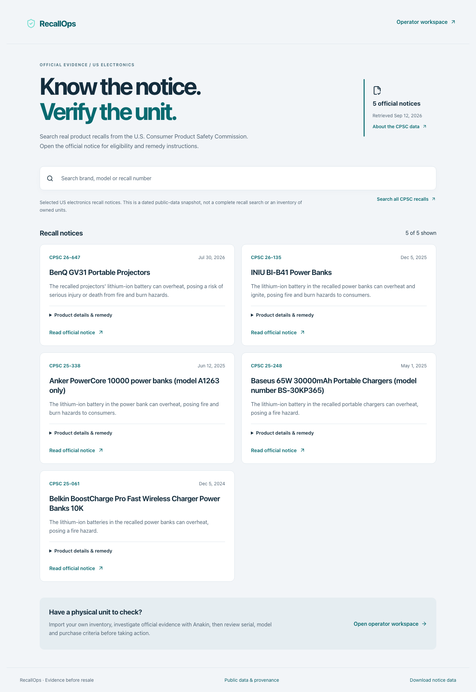
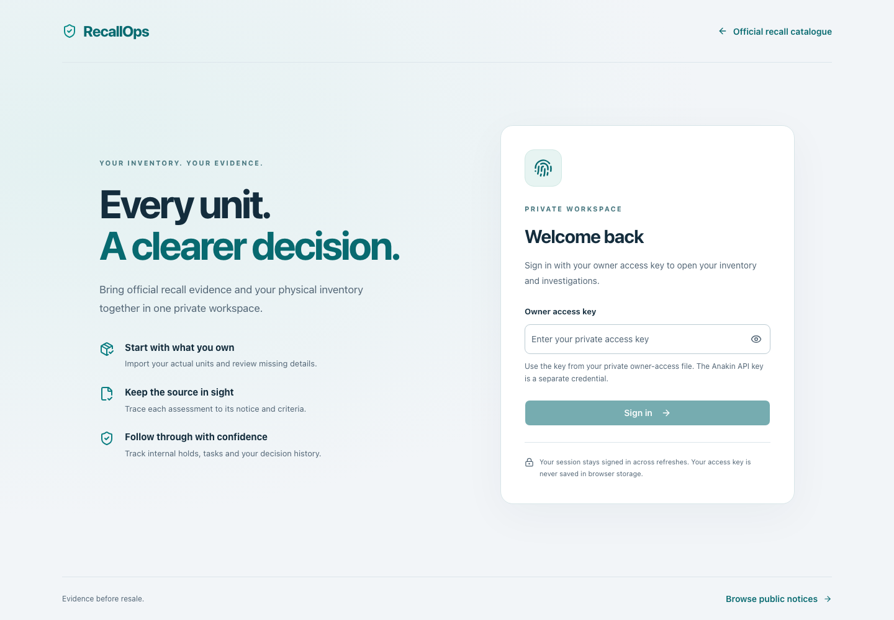

# RecallOps

RecallOps helps electronics teams turn official recall evidence into decisions about individual physical units. Public recall notices describe products; your inventory supplies the actual serial number, variant and original purchase facts. Missing or conflicting facts stay in review.

[GitHub](https://github.com/Sree24-ui/RecallOps) · [Live website](https://recallops-nine.vercel.app)



## What you can do

- Browse and search a dated selection of real CPSC electronics recall notices, expand API product descriptions and open the original notice for current remedy instructions, and open the original notice.
- Open the protected operator workspace, download a blank CSV template, and import inventory you actually hold.
- Investigate selected product groups through Anakin Search and URL Scraper. Preserve source text, retrieval times, hashes and extracted criteria.
- Compare unit facts with evidence using a deterministic TypeScript matcher. Review affected, excluded, unresolved or no-notice results with an explanation.
- Maintain internal holds and staff tasks, export action packets, and manually run paused official-source monitors.

Public catalogue requests neither read the inventory database nor call paid providers. Open Operator workspace and sign in with the owner access key from your private owner-access file. The browser receives a signed, 12-hour HttpOnly session cookie, so refreshing keeps you signed in. Sign out in Settings. The access key is never saved in browser storage; explicit bearer access remains available for API clients. This is a single-operator prototype, not a multi-tenant service.

## Workspace access and settings

The workspace opens with a clear owner sign-in screen. Settings shows session expiry, actual integration configuration, approved sources and current limits. Table spacing switches between Comfortable and Compact; Wire enrichment lives in each unit’s case.



[Desktop settings](docs/screenshots/settings-desktop.png) · [Mobile settings](docs/screenshots/settings-mobile.png)

## Real data and its limits

`data/official-recalls.json` contains five records fetched directly from the [CPSC public recall API](https://www.cpsc.gov/Recalls/CPSC-Recalls-Application-Program-Interface-API-Information), including each API request URL and retrieval timestamp. The [official Data.gov listing](https://catalog.data.gov/dataset/recalls-api) identifies this as public data. The selection covers BenQ, INIU, Anker, Baseus and Belkin; it is a dated snapshot, not a complete or continuously refreshed recall feed.

Refresh selected notices using documented CPSC recall numbers without hyphens:

```sh
npm run catalog:refresh -- 26647 26135 25338 25248 25061
```

The refresh rejects incomplete or ambiguous records and non-notice URLs. Remedy instructions are not copied from the API: a verified upstream mismatch linked INIU power banks to unrelated planer instructions. Use the original CPSC notice for the current remedy; the catalogue is not used as eligibility evidence by the investigator. It creates no physical inventory. Update and rebuild the site to publish a newer snapshot.

The normal workspace starts empty. The prior local demonstration units have been archived with audit history preserved. Synthetic cases remain only as explicit regression-test fixtures, disabled in normal and hosted execution. The normal CSV download contains headers only. No fake serial, customer, purchase or inventory count is inferred from public data.

## Run locally

Requires Node.js 24 and npm.

```sh
git clone https://github.com/Sree24-ui/RecallOps.git
cd RecallOps
npm ci
cp .env.example .dev.vars
npm run db:migrate
npm run dev -- --port 3001
```

Open the URL printed by the server. `/` is the official catalogue; `/workspace` is the operator interface. The migration command creates an empty SQLite database at the ignored `.data/recallops.sqlite` path. Open `RecallOps.code-workspace` in a compatible editor to use the project workspace.

Set `ANAKIN_API_KEY` in the ignored `.dev.vars` file for live investigations, then restart. The catalogue needs no key. Keep `ENABLE_TEST_FIXTURES=false` for normal use.

| Configuration | Purpose |
| --- | --- |
| `ANAKIN_API_KEY` | Server-side Anakin REST credential |
| `OPERATOR_TOKEN` | Owner sign-in key and session-signing secret; also supports bearer API clients |
| `PUBLIC_BASE_URL` | Actual deployed HTTPS origin for monitor callbacks |
| `TURSO_DATABASE_URL` | Persistent `libsql://` database on Vercel; optional local `file:` override |
| `TURSO_AUTH_TOKEN` | Server-only credential for the hosted Turso database |
| `ENABLE_TEST_FIXTURES` | Explicit local isolated-test opt-in; forcibly disabled on Vercel and Netlify |

To run a local production build:

```sh
NITRO_PRESET=node-server npm run build
PORT=3001 npm start
```

Stop the development server before starting another server on the same port. The local production server uses the same `.dev.vars` configuration and database.

## How it runs

React 19 renders the responsive interface. TypeScript runs both UI and deterministic eligibility rules. Vinext, Vite and Nitro build the application for Node.js 24 on Vercel. Turso provides persistent SQLite-compatible storage for inventory, source versions, assessments, tasks and append-only audits; local development uses a SQLite file through the same libSQL adapter. Drizzle generates schema migrations. Database write batches are atomic, and migrations preserve foreign keys and immutable-audit triggers.

Anakin Search discovers candidate pages. URL Scraper retrieves source text and proposes structured criteria, which must pass schema and evidence-grounding checks. Wire can enrich a user-selected Amazon listing without inventing physical serials. Monitoring can create a paused subscription and request checks. Anakin does not make the final eligibility decision.

The live workflow permits specific CPSC recall notices and approved INIU manufacturer sources, with eight product groups, two source documents per group and a 240-second provider-work deadline inside the 300-second Vercel function limit. These limits and approved hosts are explicit policy configuration in `lib/core/runtime-policy.ts`. Deferred groups keep their existing assessments. Candidate notice links are traceable to `data/source-links.json`; they are freshly retrieved, not used as automatic eligibility answers.

The narrowly scoped INIU linked-notice reconciliation is a documented safety rule. It requires identical shared predicates and preserves manufacturer exclusions; other conflicting logic needs review. Removing this evidence rule as if it were a fake value would weaken matching safety.

## Validation

```sh
npm run typecheck
npm run lint
npm test
npm run test:libsql
npm run evaluate
npm run build:vercel
```

Browser regressions use a separate database and explicit fixture mode:

```sh
mkdir -p .data
TURSO_DATABASE_URL=file:.data/e2e.sqlite npm run db:migrate
NITRO_PRESET=node-server npm run build
TURSO_DATABASE_URL=file:.data/e2e.sqlite ENABLE_TEST_FIXTURES=true PORT=3002 npm start
# In another terminal:
npm run test:e2e
```

To run the four additional owner-session browser checks, start another server with a separate empty database and a disposable test key:

```sh
TURSO_DATABASE_URL=file:.data/session-e2e.sqlite npm run db:migrate
TURSO_DATABASE_URL=file:.data/session-e2e.sqlite ENABLE_TEST_FIXTURES=false OPERATOR_TOKEN=recallops-isolated-e2e-owner-key PORT=3003 npm start
# With both test servers running:
RECALLOPS_AUTH_URL=http://0.0.0.0:3003 RECALLOPS_TEST_ACCESS_KEY=recallops-isolated-e2e-owner-key npm run test:e2e
```

Using 0.0.0.0 instead of localhost exercises remote authentication on the local test server without changing production credentials. These checks include intentionally invalid attempts; the test session may be throttled for up to one minute afterward.

Keep the E2E database separate from normal inventory. Tests include raw source validation failures, deferred scans, archived inventory, test-mode isolation, public data provenance, imports, source grounding, task conflicts, signature validation and browser interactions. `test:libsql` exercises the database adapter against isolated temporary SQLite files. Controlled matcher evaluations are not claims of live extraction accuracy. The live integration test is credential-gated and makes paid provider requests only when explicitly run.

## Deployment and submission

Vercel is the selected deployment provider. Nitro emits the Vercel Build Output API bundle under `.vercel/output`; the operator backend requires a persistent Turso database. Server-only secrets are configured in Vercel, never committed. The postbuild check removes environment files from generated output. Only schema migrations are applied to the hosted database; no local database or test inventory is uploaded. See [deployment instructions](docs/DEPLOYMENT.md) for setup and verification. The older Sites configuration is historical and is not used by the Vercel build.

See [GitHub automatic deployment setup](docs/AUTO-DEPLOY.md). This workspace already pushes to GitHub; the Vercel project is now connected to this repository and its main branch.

See [submission answers](SUBMISSION.md) and [demo walkthrough](DEMO.md). The separate submission ZIP includes the captioned WebM video, screenshots, copy-ready answers and a clean source archive. Video upload, social posting, the GitHub star screenshot and the final form submission are separate user actions.

## Boundaries

“No relevant notice found” does not establish safety. Holds are internal inventory actions and are never silently released by acknowledgement or reassessment. No claim, customer message, purchase or disposal confirmation is submitted automatically. Source retrieval can fail; rejected extractions preserve the fetched evidence and remain review cases. Scheduled monitor activation and end-to-end signed external webhook delivery have not been verified.

Historical Anakin verification used clearly labelled sample physical units and real provider calls; those observations remain documented in `docs/live-verification.json` and are not represented as real customer inventory or current production outcomes.

Built and committed by **Sree24-ui**, the sole repository contributor.
