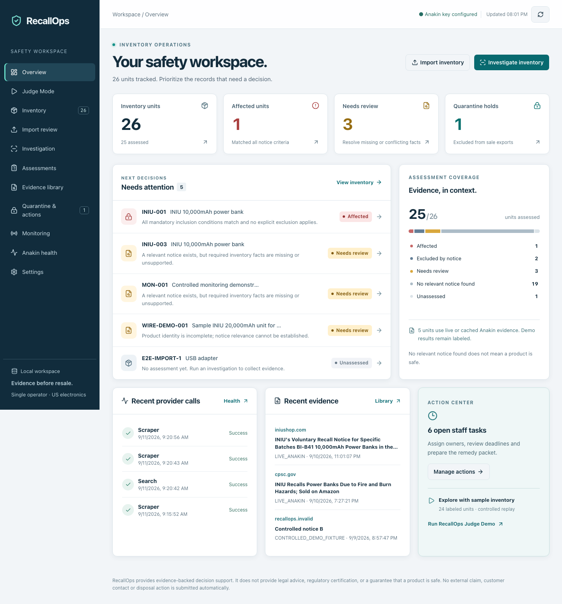

> Historical verification before the September 12 real-data release. Sample units shown here were test records and are now archived. See README.md for current normal behavior.

# Frontend verification — September 11–12, 2026

RecallOps now opens on an operational overview backed by the workspace API. Totals, assessment coverage, attention records, open tasks, provider activity and evidence are derived from persisted records. No synthetic chart data or fabricated provider success is displayed.

## UI changes

- Responsive overview with actionable totals, priority queue, evidence coverage and recent activity.
- Search across asset, title, brand, model, serial, retailer, SKU and batch; status/hold filters, sorting, pagination and clear empty states.
- Browser history and reloadable case/source links; keyboard skip navigation, visible focus, reduced motion and accessible mobile safety descriptions.
- Mobile inventory cards and expandable criteria preserve the exact evidence while reducing wide-table scrolling.
- Explicit loading, refresh, stale-data and error states. Background polls wait for in-flight reads; newer responses cannot be overwritten by older requests.
- CSV review freezes input and imports the reviewed snapshot. Task edits retain drafts, reject stale revisions atomically and expose conflicts for review.
- Case audit timelines and exported packets include staff-task changes.

## Hardcoded behavior audit

| Finding                                             | Resolution                                                                         |
| --------------------------------------------------- | ---------------------------------------------------------------------------------- |
| Static demo-first homepage                          | Replaced with data-driven overview; controlled demo remains available explicitly.  |
| Fixed fixture count and selected case               | Metadata comes from the fixture catalog; Judge selects its actual affected result. |
| Preselected INIU monitor URL                        | Empty input with suggestions drawn from preserved live/cached sources.             |
| INIU supporting link in every action packet         | Packets render supporting URLs only from that case's evidence.                     |
| Retry action always reported processed              | Reports attempted, successful and unresolved counts, including the no-work case.   |
| Product grouping differed from server normalization | Uses the same brand/model normalization functions.                                 |
| CSV limits copied into the UI                       | Uses shared server/parser limits.                                                  |
| Provider configuration looked missing before load   | Shows connection state until workspace data is available.                          |

Controlled fixtures, approved-source boundaries, validation limits, safety statuses and explicit notice reconciliation remain intentional domain configuration. Their removal would weaken reproducibility or eligibility checks. The application still supports a local single operator and approved CPSC/INIU sources; this redesign does not expand recall coverage.

## Verification

- TypeScript and lint: passed.
- Unit/integration tests: 166 passed, 1 credential-gated live test skipped.
- Browser regression tests: 14 passed in 14.6 seconds, including task conflicts, confirmed saves during failed refreshes, slow polling, CSV snapshot review, history, mobile safety descriptions and scoped exports.
- Controlled evaluation: 45/45 expected outcomes; no provider requests.
- Production build: passed; generated environment files removed by the postbuild check.
- Credential scan: no local API key found in 226 source/build files; no generated environment files remain. The ignored local key file retains mode 0600.
- Browser verification uses the compiled worker on port 3002 and a separate database. Live workspace data is preserved on port 3001.
- Desktop (1440 px) and mobile (390 px) previews: no browser errors or horizontal page overflow in the overview and case views.
- Local preview retained 26 units, including 5 assessments labeled `LIVE_ANAKIN`; no new Anakin calls were made for this UI work.

[Mobile overview](screenshots/workspace-mobile.png) · [Desktop case](screenshots/case-desktop.png) · [Mobile case](screenshots/case-mobile.png)

This report supplements the earlier [live-provider verification](RELEASE-VERIFICATION.md). Signed external webhook delivery, public deployment and production readiness remain outside this UI verification.
